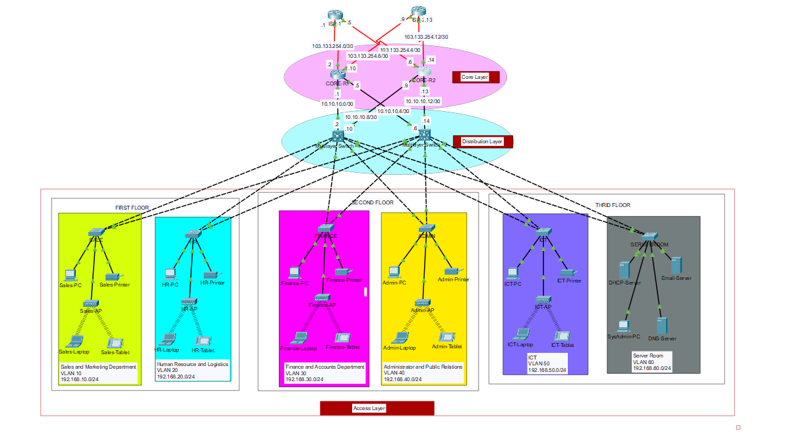

# Company Business System Network Design

Portfolio and academic networking project using Cisco Packet Tracer. The project designs a scalable company network for a multi-floor business center with VLAN segmentation, inter-VLAN routing, DHCP, OSPF, NAT/PAT, wireless access, SSH, ACLs, and port security.

## Student Information

| Field | Details |
| --- | --- |
| Name | Subham Bej |
| University | Swami Vivekananda University |
| Program | MCA |
| Academic Session | 2024-2026 |
| Roll No. | 011-MCA-2024-038 |
| Registration No. | 011-122-2024-038 |

## Project Objective

The goal of this project is to design and simulate a reliable enterprise network for a company/business system. The network supports multiple departments across three floors, uses separate VLANs and subnets for each department, provides dynamic IP allocation through DHCP, and uses redundant core and ISP connectivity for better availability.

## Key Features

- Hierarchical enterprise network design using Cisco Packet Tracer.
- Separate VLANs for Sales, HR, Finance, Admin, ICT, and Server Room.
- Inter-VLAN routing using multilayer switches.
- DHCP-based dynamic IP allocation for end-user devices.
- Static IP addressing for server room devices.
- OSPF routing between routers and multilayer switches.
- NAT/PAT configuration for internet access.
- SSH configuration for secure remote access.
- ACL and port-security implementation for controlled access.
- Wireless network support for departments.
- Connectivity testing using ping, traceroute, and DHCP verification.

## Technologies Used

- Cisco Packet Tracer
- VLANs and Subnetting
- Inter-VLAN Routing
- DHCP
- OSPF
- NAT/PAT
- ACL
- SSH
- Port Security
- Wireless LAN

## Repository Structure

```text
.
+-- All Commands/
|   +-- Access Layer.txt
|   +-- Check.txt
|   +-- Core Layer.txt
|   +-- ISP.txt
|   +-- Multi Layer.txt
|   +-- Network Config.txt
+-- Company Business System Network Design (Project #6).pkt
+-- Company Business System Network Design (Project #6).pdf
+-- Project Report.pdf
+-- STUDENT_DETAILS.md
+-- GITHUB_UPLOAD_STEPS.md
+-- image.png
+-- LICENSE
+-- README.md
```

## Topology



## How to Open the Project

1. Install Cisco Packet Tracer.
2. Open `Company Business System Network Design (Project #6).pkt`.
3. Review the topology, VLANs, routing configuration, DHCP, NAT/PAT, and security settings.
4. Use the files inside `All Commands/` to study the device configuration commands.
5. Check the PDFs for project explanation and report content.

## Recommended GitHub Repository Name

```text
company-business-system-network-design
```

## Suggested GitHub Topics

```text
cisco packet-tracer networking vlan ospf dhcp nat acl ssh port-security mca-project
```

## Attribution

This repository package keeps the original MIT license included in the source files. If this project is used for academic submission, portfolio presentation, or further modification, review the license and cite any reused reference material properly.
